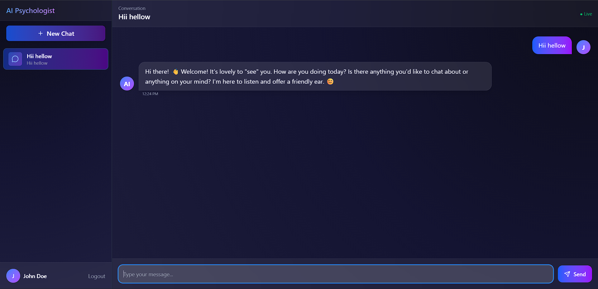
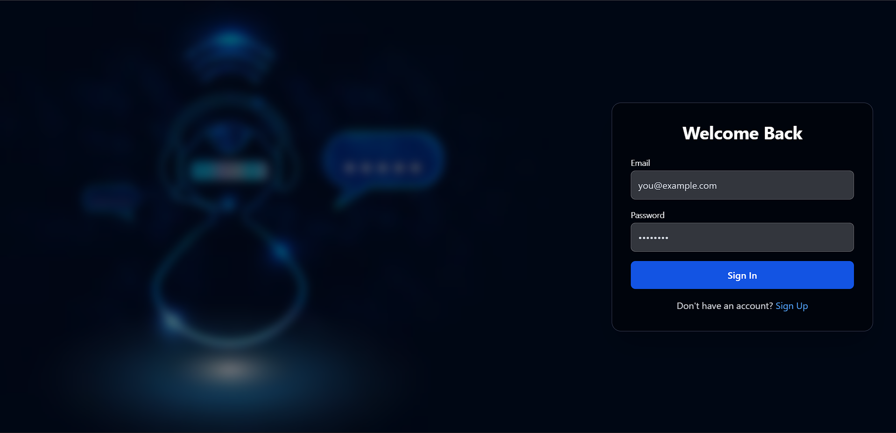
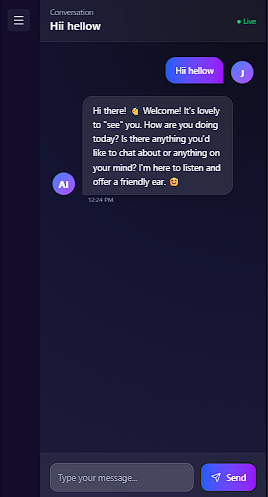

# AI Psychologist

A modern web application that provides an AI-powered psychological counseling experience through natural conversation. The application features a sleek, user-friendly interface with real-time chat functionality and seamless dark/light mode support.



## Project Overview

AI Psychologist is designed to provide accessible psychological support through an AI-powered conversational interface. The application offers:

- 🧠 Intelligent, empathetic responses using Google's Gemini AI
- 💬 Real-time chat functionality with message history
- 🎨 Modern, responsive UI with dark/light mode support
- 🔒 Secure user authentication and data privacy
- 📱 Full mobile responsiveness with intuitive navigation

## Tech Stack

### Frontend
- **React 18** with **TypeScript** for type-safe development
- **Vite** for fast development and optimized builds
- **Tailwind CSS** for modern, responsive styling
- **Framer Motion** for smooth animations
- **Zustand** for state management
- **Axios** for API communication

### Backend
- **Node.js** with **Express**
- **TypeScript** for enhanced development experience
- **MongoDB** for data persistence
- **Google Gemini AI** for intelligent responses
- **JWT** for secure authentication

## Setup Instructions

### Prerequisites
- Node.js (v16 or higher)
- MongoDB installed locally or a MongoDB Atlas account
- Google Cloud account for Gemini AI API access

### Environment Setup

1. Clone the repository:
   ```bash
   git clone https://github.com/avishkar13/AI-Psychologist.git
   cd AI-Psychologist
   ```


2. Backend Setup (.env in server folder):
   ```env
   MONGODB_URI=your_mongodb_connection_string
   JWT_SECRET=your_jwt_secret
   GEMINI_API_KEY=your_gemini_api_key
   PORT=5000
   CLIENT_URL=your_client_url
   ```

## Running the Application

### Backend
1. Navigate to the server directory:
   ```bash
   cd server
   ```

2. Install dependencies:
   ```bash
   npm install
   ```

3. Start the server:
   ```bash
   npm run dev
   ```
   The server will start on http://localhost:5000

### Frontend
1. Navigate to the client directory:
   ```bash
   cd client
   ```

2. Install dependencies:
   ```bash
   npm install
   ```

3. Start the development server:
   ```bash
   npm run dev
   ```
   The application will be available at http://localhost:5173

## Features

- **User Authentication**: Secure signup and login functionality
- **Chat Interface**: Modern, responsive chat UI with message history
- **Theme Support**: Seamless dark/light mode switching
- **Real-time Updates**: Instant message updates and responses
- **Mobile Responsive**: Fully functional on all device sizes
- **Message History**: Persistent chat history with conversation context

## Screenshots

### Authentication Page


### Chat Interface


### Mobile View


## Contributing

1. Fork the repository
2. Create your feature branch (`git checkout -b feature/amazing-feature`)
3. Commit your changes (`git commit -m 'Add some amazing feature'`)
4. Push to the branch (`git push origin feature/amazing-feature`)
5. Open a Pull Request

## License

This project is licensed under the MIT License - see the [LICENSE](LICENSE) file for details

## Acknowledgments

- Google Gemini AI for providing the conversation AI capabilities
- OpenAI for inspiration and guidance
- The amazing open-source community for the tools and libraries used in this project
